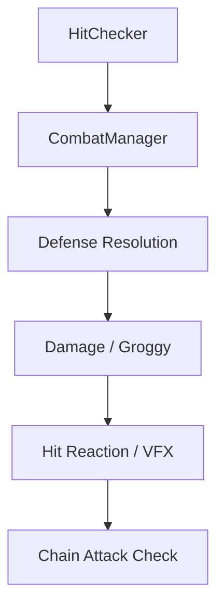

# 3D Action Combat System — ZZZ Recreation Project

Unity 6를 기반으로 **Zenless Zone Zero의 전투 시스템을 분석하고 재구현한 3D 액션 게임 포트폴리오**입니다.

레퍼런스의 시각적 재현뿐만 아니라 캐릭터 상태 전환과 공격 판정, 회피·패링·교대·빠른 지원·그로기·Chain Attack이 하나의 전투 흐름으로 연결되도록 시스템 구조를 설계했습니다.

> 현재 개발 진행 중인 개인 프로젝트입니다.  
> 본 저장소는 외부 에셋을 제외한 **C# 소스 코드 및 Unity 프로젝트 설정 검토용 저장소**입니다.

---

## 프로젝트 정보

| 항목 | 내용 |
|---|---|
| 개발 형태 | 개인 프로젝트 |
| 개발 엔진 | Unity 6 `6000.3.13f1` |
| 개발 언어 | C# |
| 렌더 파이프라인 | Universal Render Pipeline |
| 주요 패키지 | Cinemachine 3, Input System, Timeline |
| 레퍼런스 | Zenless Zone Zero |
| 개발 상태 | Work in Progress |

---

## 플레이 영상 및 포트폴리오

- **플레이 영상:** 준비 중
- **포트폴리오 문서:** 준비 중

플레이 영상은 Unity Editor의 Game View를 기준으로 촬영하며, 실제 구현된 전투 시스템의 동작을 보여줍니다.

---

## 핵심 구현 시스템

### 1. 캐릭터 상태 관리

`Hero`를 중심으로 이동과 공격, 스킬, 회피, 피격, 교대 및 지원 행동을 상태 단위로 관리합니다.

- Idle / Walk / Run / Sprint
- Attack / Skill / Ultimate
- Dodge / Dodge Counter
- Parry Assist / Parry Counter
- Quick Assist
- Chain Attack
- Hit / Knockback / Dead
- Swap In / Swap Out / Inactive

각 상태의 진입과 종료 시점에 무적, 이동, 애니메이션, 타깃 및 입력 상태를 동기화하도록 구성했습니다.

---

### 2. 데이터 기반 전투 구조

공격 수치와 판정 정보를 `ScriptableObject`로 분리하여, 기존 처리 구조를 수정하지 않고 캐릭터별 공격 데이터를 추가·조정할 수 있도록 구성했습니다.

공격 처리 과정에서 다음 정보를 하나의 전투 컨텍스트로 전달합니다.

- 공격자 및 피격 대상
- Damage / Impact(Groggy 누적량)
- Critical 여부
- Hit Type
- 공격 위치 및 방향
- 표면 방향
- VFX 데이터
- Hit Mark 데이터

이를 통해 Hero와 Enemy의 공격을 공통된 전투 처리 흐름으로 확장할 수 있도록 설계했습니다.

---

### 3. 통합 타격 처리

공격 판정 이후 방어 판정, 피해 계산, 그로기 누적, 피격 반응, VFX 및 Chain Attack 조건 확인을 `CombatManager`에서 순차적으로 처리합니다.



피해가 실제로 적용된 경우에만 후속 타격 연출과 시스템이 실행되도록 처리 흐름을 구분했습니다.

---

### 4. 회피 및 패링 지원

적의 공격 타이밍과 공격 속성을 기준으로 다음 방어 행동을 처리합니다.

- 일반 회피
- 극한 회피
- 회피 반격
- 패링 가능 여부 판정
- 패링 지원 캐릭터 등장
- 패링 반격
- 패링 대상 유지 및 방향 동기화

패링 직후 공격 대상이 변경되지 않도록 `LockOnManager`의 전투 타깃과 패링 대상을 동기화했습니다.

---

### 5. 캐릭터 교대 및 빠른 지원

일반 교대, 빠른 교대, 패링 지원, 빠른 지원을 서로 다른 발동 규칙과 실행 흐름으로 분리했습니다.

빠른 지원은 다음 조건에서 활성화됩니다.

- 현재 Hero가 Knockback 공격에 피격된 경우
- 특정 공격의 Animation Event에서 빠른 지원 활성화 명령을 호출한 경우

`QuickAssistManager`는 지원 창의 생명주기와 실행 데이터를 관리하고, `PartySwapManager`는 실제 캐릭터 교대와 등장 처리를 담당합니다.

세션 ID를 사용하여 이전 빠른 지원 요청이 현재 요청에 영향을 주지 않도록 실행 컨텍스트를 검증합니다.

---

### 6. 그로기 및 Chain Attack

Enemy의 그로기 수치가 최대치에 도달하면 Chain Attack(콤보 스킬) 선택 QTE로 전환합니다.

- 그로기 누적 및 소모 상태 관리
- Chain Attack 후보 캐릭터 판정
- 선택 시간 및 입력 관리
- 선택 중 일반 입력 제한
- Chain Attack 실행과 종료 처리
- 연출 카메라 및 시간 제어

전투 상태와 UI 선택 상태, 캐릭터 교대 상태가 충돌하지 않도록 각 시스템의 책임을 분리했습니다.

---

### 7. 전투 타깃 및 이동 보정

Soft Lock과 Hard Lock을 구분하고, 공격 행동에 따라 적절한 타깃을 탐색하도록 구성했습니다.

- Soft / Hard Lock-On
- 공격 대상 갱신
- 패링 및 반격 대상 고정
- 공격 중 방향 보정
- Magnetic Movement
- 교대 및 지원 등장 위치 계산

공격 애니메이션의 이동 구간은 Animation Event를 통해 활성화하고, 실제 이동 계산은 `HeroMovement`에서 처리합니다.

---

### 8. 전투 연출 및 VFX

타격 결과에 따라 Hit Impact, Hit Mark, Warning Sign 등의 VFX를 호출하도록 구성했습니다.

- Hit Impact
- Hit Mark
- Parry / Dodge Warning Sign
- Sword Trail
- Hit Stop
- Slow Motion
- Cinemachine 전투 카메라
- MaterialPropertyBlock 기반 Fade
- Queue 기반 Object Pooling

Hero와 Enemy 중 어느 쪽이 공격자인지에 따라 필요한 VFX 데이터를 선택할 수 있도록 확장성을 고려했습니다.

---

## 주요 코드 구조

```text
Assets/
├─ 01_Scripts/
│  ├─ Hero/       # Hero 상태, 이동, 애니메이션, 공격 및 피격 처리
│  ├─ Enemy/      # Enemy AI, 패턴, 그로기 및 공격 처리
│  ├─ Manager/    # 전투, 교대, 지원, 타깃 및 연출 시스템
│  ├─ SO/         # 캐릭터 및 전투 데이터
│  ├─ UI/         # 전투 UI
│  ├─ Utility/    # 공통 인터페이스와 보조 구조
│  └─ VFX/        # 타격 및 전투 연출 제어
└─ 08_InputActions/
   └─ HeroActions.inputactions
```

### 주요 진입 코드

- [`Hero`](Assets/01_Scripts/Hero/Hero.cs): Hero 상태와 전투 행동 제어
- [`CombatManager`](Assets/01_Scripts/Manager/CombatManager.cs): 통합 타격 처리
- [`PartySwapManager`](Assets/01_Scripts/Manager/PartySwapManager.cs): 파티 교대 실행
- [`QuickAssistManager`](Assets/01_Scripts/Manager/QuickAssistManager.cs): 빠른 지원 생명주기 관리
- [`ChainAttackManager`](Assets/01_Scripts/Manager/ChainAttackManager.cs): 콤보 스킬 선택(QTE) 및 실행
- [`LockOnManager`](Assets/01_Scripts/Manager/LockOnManager.cs): 전투 타깃 관리
- [`CombatPresentationManager`](Assets/01_Scripts/Manager/CombatPresentationManager.cs): 카메라 및 전투 연출 관리

---

## 저장소 실행 및 열람 안내

1. 저장소를 Clone하거나 Download ZIP으로 내려받습니다.
2. Unity Hub에서 저장소 최상위 폴더를 프로젝트로 등록합니다.
3. Unity `6000.3.13f1` 버전으로 프로젝트를 실행합니다.
4. Package Manager의 패키지 복원이 완료될 때까지 기다립니다.

본 저장소에서는 라이선스 문제가 발생할 수 있는 외부 모델, 애니메이션, 텍스처, 사운드 및 VFX 에셋을 제외했습니다.

따라서 프로젝트 구조와 C# 소스 코드는 열람할 수 있지만, 원본 개발 프로젝트와 동일한 씬을 실행하거나 완성된 게임플레이를 재현할 수는 없습니다. 실제 동작 결과는 플레이 영상과 포트폴리오 문서에서 확인할 수 있습니다.

---

## 외부 에셋 안내

원본 프로젝트에는 Unity Asset Store 및 기타 배포처에서 제공된 무료 에셋이 사용되었습니다.

해당 에셋은 무료 여부와 관계없이 원본 파일의 재배포 권한이 별도로 부여되지 않을 수 있으므로, 이 공개 저장소에는 포함하지 않았습니다.

본 저장소는 직접 작성한 C# 코드와 Unity 프로젝트 설정을 중심으로 구성되어 있습니다.

---

## 저작권 및 이용 안내

본 프로젝트는 개인 학습 및 취업 포트폴리오 목적으로 제작된 비상업적 프로젝트이며, Zenless Zone Zero의 공식 프로젝트가 아닙니다.

Zenless Zone Zero 및 관련 상표와 원작 콘텐츠의 권리는 각 권리 보유자에게 있습니다.

본 저장소에는 별도의 오픈소스 라이선스를 부여하지 않습니다. 채용 검토와 개인 학습 목적의 로컬 열람 및 수정은 허용하지만, 작성자의 허가 없는 코드 재배포, 상업적 이용 및 저작자 사칭은 허용하지 않습니다.